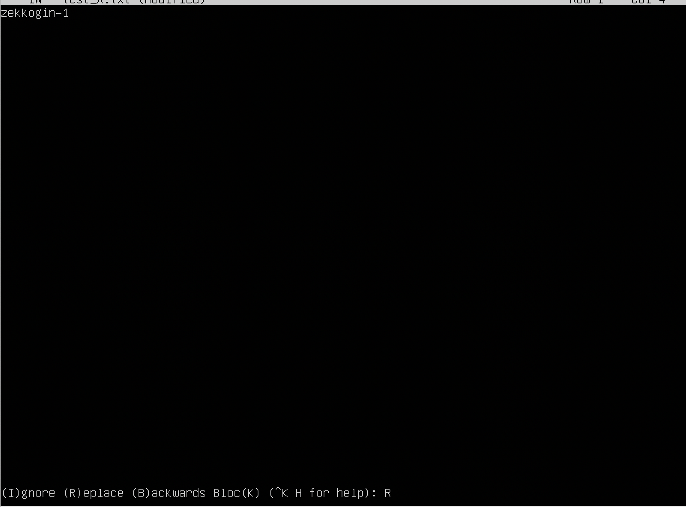

# Операционные системы UNIX/Linux (Базовый).

## Part 1. Установка ОС

##### Установить **Ubuntu 20.04 Server LTS** без графического интерфейса. (Используем программу для виртуализации - VirtualBox)

- Графический интерфейс должен отсутствовать.

- Узнайте версию Ubuntu, выполнив команду \
`cat /etc/issue.`
- Вставьте скриншот с выводом команды.

## Part 2. Создание пользователя

##### Создать пользователя, отличного от пользователя, который создавался при установке. Пользователь должен быть добавлен в группу `adm`.

- Вставьте скриншот вызова команды для создания пользователя.
- Новый пользователь должен быть в выводе команды \
`cat /etc/passwd`
- Вставьте скриншот с выводом команды.

## Part 3. Настройка сети ОС

##### Задать название машины вида user-1
- sudo hostname user-1
- перезайти за пользователя для отображения в консоли
##### Установить временную зону, соответствующую вашему текущему местоположению.

##### Вывести названия сетевых интерфейсов с помощью консольной команды.

- lo (loopback device) – виртуальный интерфейс, присутствующий по умолчанию в любом Linux. Он используется для отладки сетевых программ и запуска серверных приложений на локальной машине. С этим интерфейсом всегда связан адрес 127.0.0.1. У него есть dns-имя – localhost. Посмотреть привязку можно в файле /etc/hosts.

##### Используя консольную команду получить ip адрес устройства, на котором вы работаете, от DHCP сервера. 

- DHCP — протокол автоматизации назначения IP-адреса клиенту. Он широко используется в современных сетях.

- DHCP — протокол прикладного уровня модели TCP/IP, служит для назначения IP-адреса клиенту. Это следует из его названия — Dynamic Host Configuration Protocol. IP-адрес можно назначать вручную каждому клиенту, то есть компьютеру в локальной сети. Но в больших сетях это очень трудозатратно, к тому же, чем больше локальная сеть, тем выше возрастает вероятность ошибки при настройке. Поэтому для автоматизации назначения IP был создан протокол DHCP.

##### Определить и вывести на экран внешний ip-адрес шлюза (ip) и внутренний IP-адрес шлюза, он же ip-адрес по умолчанию (gw). 

##### Задать статичные (заданные вручную, а не полученные от DHCP сервера) настройки ip, gw, dns (использовать публичный DNS серверы, например 1.1.1.1 или 8.8.8.8).

##### Перезагрузить виртуальную машину. Убедиться, что статичные сетевые настройки (ip, gw, dns) соответствуют заданным в предыдущем пункте.

- Успешно пропинговать удаленные хосты 1.1.1.1 и ya.ru и вставить в отчёт скрин с выводом команды. В выводе команды должна быть фраза "0% packet loss".

## Part 4. Обновление ОС

##### Обновить системные пакеты до последней на момент выполнения задания версии.  

- После обновления системных пакетов, если ввести команду обновления повторно, должно появится сообщение, что обновления отсутствуют.

## Part 5. Использование команды **sudo**

##### Разрешить пользователю, созданному в [Part 2](#part-2-создание-пользователя), выполнять команду sudo.

- Sudo - это альтернатива su для выполнения команд с правами суперпользователя (root). В отличие от su, который запускает оболочку с правами root и даёт всем дальнейшим командам root-права, sudo предоставляет временное повышение привилегий для одной команды. Предоставляя привилегии root только при необходимости, sudo снижает вероятность того, что опечатка или ошибка в выполняемой команде произведут в системе разрушительные действия.

- Поменять hostname ОС от имени пользователя, созданного в пункте [Part 2](#part-2-создание-пользователя) (используя sudo).

## Part 6. Установка и настройка службы времени

##### Настроить службу автоматической синхронизации времени.  

- Вывести время, часового пояса, в котором вы сейчас находитесь.
- Вывод следующей команды должен содержать `NTPSynchronized=yes`: \
  `timedatectl show`
- Вставить скрины с корректным временем и выводом команды в отчёт.

## Part 7. Установка и использование текстовых редакторов 

##### Установить текстовые редакторы **VIM** (+ любые два по желанию **NANO**, **MCEDIT**, **JOE** и т.д.)  
##### Используя каждый из трех выбранных редакторов, создайте файл *test_X.txt*, где X -- название редактора, в котором создан файл. Напишите в нём свой никнейм, закройте файл с сохранением изменений.  

- В отчёте укажите, что сделали для выхода с сохранением изменений.

- **Save**: **Vim** SHIFT + ';' -> wq / **Nano** ctrl + X -> Yes / **Joe** ctrl + KX

##### Используя каждый из трех выбранных редакторов, откройте файл на редактирование, отредактируйте файл, заменив никнейм на строку "21 School 21", закройте файл без сохранения изменений.

- В отчёте укажите, что сделали для выхода без сохранения изменений.

- **Exit**: **Vim** SHIFT + ';' -> q! / **Nano** ctrl + X -> NO / **Joe** ctrl + C -> Yes

##### Используя каждый из трех выбранных редакторов, отредактируйте файл ещё раз (по аналогии с предыдущим пунктом), а затем освойте функции поиска по содержимому файла (слово) и замены слова на любое другое.

- **Find**: **Vim** SHIFT + ';' -> /pattern   **Replace**: SHIFT + ';' -> :s/foo/bar/
- **Find**: **Nano** ctrl + W -> pattern   **Replace**: ctrl + \ -> pattern to search -> pattern to replace
- **Find**: **Joe** ctrl + KF -> pattern    **Replace**: ctrl + KF -> R -> pattern to replace

## Part 8. Установка и базовая настройка сервиса **SSHD**

##### Установить службу SSHd.  
##### Добавить автостарт службы при загрузке системы.  
##### Перенастроить службу SSHd на порт 2022.  
##### Используя команду ps, показать наличие процесса sshd. Для этого к команде нужно подобрать ключи.
- В отчёте объяснить значение команды и каждого ключа в ней.
- ps -C sshd (-C поиск по идентификатору)

##### Перезагрузить систему.
- В отчёте опишите, что сделали для выполнения всех пяти пунктов (можно как текстом, так и скриншотами).
- **Выполненные команды:**

1. sudo apt install openssh-server - установка необходимых пакетов
2. sudo systemctl enable sshd      - установка автозапуска при включении
3. sudo systemctl status ssh       - проверка статуса службы
4. sudo nano /etc/ssh/sshd_config  - настройка порта
5. sudo systemctl restart sshd     - рестарт службы SSHD после настройки порта
6. Вывод команды netstat -tan должен содержать

`tcp 0 0 0.0.0.0:2022 0.0.0.0:* LISTEN`

- В отчёте объяснить значение ключей -tan, значение каждого столбца вывода, значение 0.0.0.0.

- t      - Просмотр только tcp соединений
- a      - Отображение всех подключений и ожидающих портов
- n      - Показывать сетевые адреса как числа
- u      - Просмотр только udp соединений

- Столбцы:
- proto           - протоколы сокета
- Recv-Q          - Счётчик байт не скопированных программой пользователя из этого сокета
- Send-Q          - чётчик байтов, не подтверждённых удалённым узлом
- Local Address   - адресс (0.0.0.0) и номер порта (2022)
- Foreign Address - адресс удаленного и порт, если установлено соедиение, удаленного сервера
- State           - состояние (Listen - порт открыт )

## Part 9. Установка и использование утилит **top**, **htop**

##### Установить и запустить утилиты top и htop.  

- По выводу команды top определить и написать в отчёте:
  - uptime
  - количество авторизованных пользователей
  - общую загрузку системы
  - общее количество процессов
  - загрузку cpu
  - загрузку памяти
  - pid процесса занимающего больше всего памяти
  - pid процесса, занимающего больше всего процессорного времени

-   Uptime 20 min 
-   1 user
-   Общая загрузка 
-   Общее количество процессов 90 (1 работает)
-   0.3%cpu
-   0.3%MEM
-   Pid 1 
-   Pid 1237

- В отчёт вставить скрин с выводом команды htop:
  - отсортированному по PID, PERCENT_CPU, PERCENT_MEM, TIME
  - отфильтрованному для процесса sshd
  - с процессом syslog, найденным, используя поиск 
  - с добавленным выводом hostname, clock и uptime 

## Part 10. Использование утилиты **fdisk**

##### Запустить команду fdisk -l.

- В отчёте написать название жесткого диска, его размер и количество секторов, а также размер swap.

Диск /dev , размер 3 гб, секторов 6285312, swap 0

## Part 11. Использование утилиты **df** 

##### Запустить команду df.  
- В отчёте написать для корневого раздела (/):
  - размер раздела
  - размер занятого пространства
  - размер свободного пространства
  - процент использования
- Определить и написать в отчёт единицу измерения в выводе.

1.  Размер раздела 3018536 байт
2.  Занятого пр-ва 2790484 байт
3.  Свободного пр-ва 54536 байт
4.  Процент использования 99%

##### Запустить команду df -Th.
- В отчёте написать для корневого раздела (/):
    - размер раздела
    - размер занятого пространства
    - размер свободного пространства
    - процент использования
- Определить и написать в отчёт тип файловой системы для раздела.

1. Размер раздела 2.9Гб
2. Занятого 2.7Гб
3. Свободного 54Мб
4. Процент использования 99%
5. Тип файловой системы ext4 (Fourth extended file system)

## Part 12. Использование утилиты **du**

##### Запустить команду du.
##### Вывести размер папок /home, /var, /var/log (в байтах, в человекочитаемом виде)

- В отчёт вставить скрины с выводом всех использованных команд.

##### Вывести размер всего содержимого в /var/log (не общее, а каждого вложенного элемента, используя *)

## Part 13. Установка и использование утилиты **ncdu**

##### Установить утилиту ncdu.
##### Вывести размер папок /home, /var, /var/log.

- Размеры должны примерно совпадать с полученными в [Part 12](#part-12-использование-утилиты-du).

## Part 14. Работа с системными журналами

##### Открыть для просмотра:
##### 1. /var/log/dmesg
##### 2. /var/log/syslog
##### 3. /var/log/auth.log  

- Написать в отчёте время последней успешной авторизации, имя пользователя и метод входа в систему.
- Time 19:44:13 zekkogin login[648]

- Перезапустить службу SSHd.
- Вставить в отчёт скрин с сообщением о рестарте службы (искать в логах).

## Part 15. Использование планировщика заданий **CRON**

##### Используя планировщик заданий, запустите команду uptime через каждые 2 минуты.
- Найти в системных журналах строчки (минимум две в заданном временном диапазоне) о выполнении.
- Вывести на экран список текущих заданий для CRON.
- Вставить в отчёт скрины со строчками о выполнении и списком текущих задач.

##### Удалите все задания из планировщика заданий.
- В отчёт вставьте скрин со списком текущих заданий для CRON.

